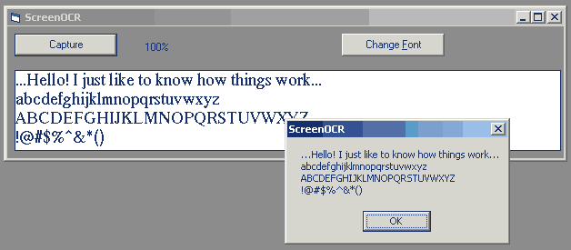



## OCR a screen capture \- proof of concept code

### Description

This code will convert text in an image to editable text. The code must know the font used, so It will only work on screen captures - not on scanned images. I intend to add a screen capture function in the near future, so you can grab any text from any window.

Right now this is just proof-of-concept code, and it has a few flaws.. :-) It doesn't work with Italic fonts or 'handwriting' fonts. I also need to find a way to get the routine find the vertical start of the text. Please comment on the general idea.
 
### More Info
 

             |
---                |---
**Submitted On**   |2003-09-17 13:15:04
**By**             |[Martijn B](https://github.com/Planet-Source-Code/PSCIndex/blob/master/ByAuthor/martijn-b.md)
**Level**          |Intermediate
**User Rating**    |4.9 (68 globes from 14 users)
**Compatibility**  |VB 6\.0
**Category**       |[Miscellaneous](https://github.com/Planet-Source-Code/PSCIndex/blob/master/ByCategory/miscellaneous__1-1.md)
**World**          |[Visual Basic](https://github.com/Planet-Source-Code/PSCIndex/blob/master/ByWorld/visual-basic.md)
**Archive File**   |[OCR\_a\_scre1646579172003\.zip](https://github.com/Planet-Source-Code/martijn-b-ocr-a-screen-capture-proof-of-concept-code__1-48585/archive/master.zip)

